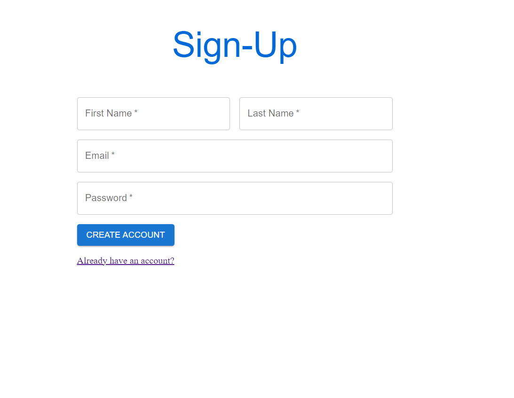
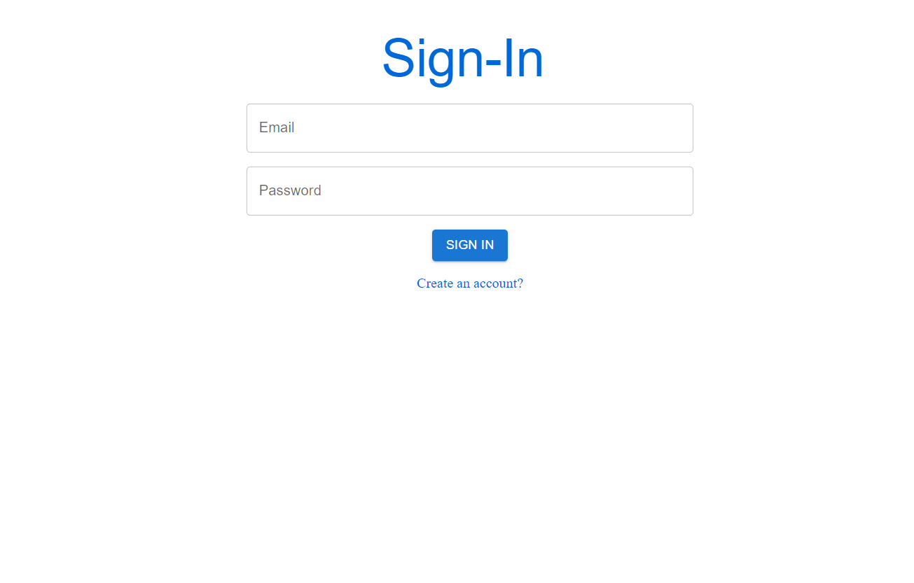
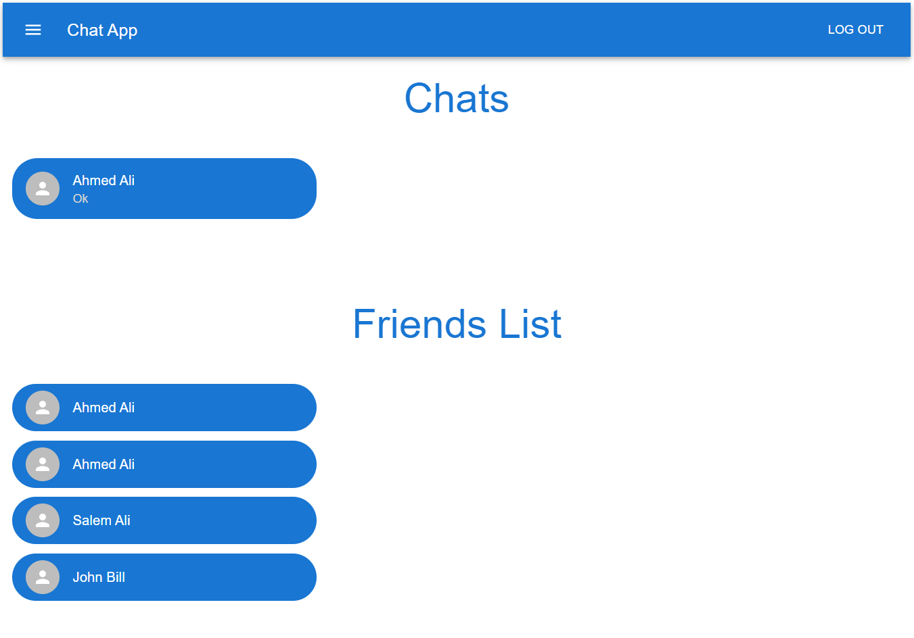
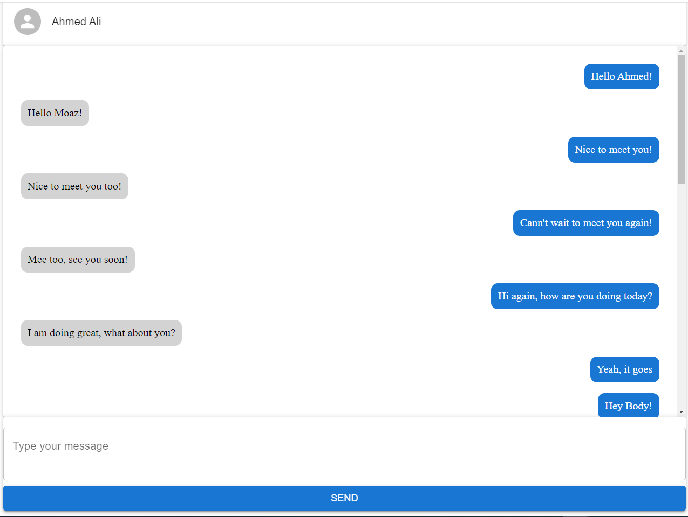
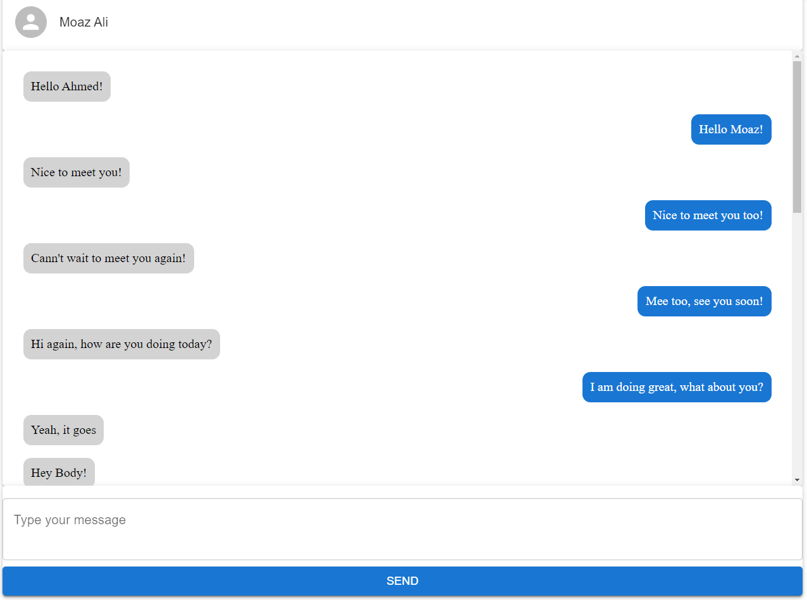

# Frontend - Web Chat Application

## Overview
The frontend for the web chat application is developed using React.js and Material-UI for building the user interface. Socket.IO is used for real-time communication with the backend server. JWT is employed for user authentication, and Axios is used for making HTTP requests to the backend API. The frontend is developed using TypeScript for type safety and improved code maintainability.

## Technologies Used
- **React.js**: JavaScript library for building user interfaces
- **Material-UI**: React components library for UI design
- **Socket.IO**: Real-time communication between clients and server
- **JWT**: JSON Web Tokens for user authentication
- **Axios**: Promise-based HTTP client for the browser and Node.js
- **TypeScript**: Superset of JavaScript for enhanced type checking and readability

## Installation
1. Clone the repository
2. Navigate to the frontend directory
3. Run `npm install` to install dependencies
4. Update the backend API URL in the `.env` file
5. Run `npm start` to start the development server

## Configuration
- Update the `.env` file with the backend API URL.

## Usage
- The frontend provides a user interface for sending and receiving messages, user authentication, and other functionalities.
- Real-time messaging is facilitated through Socket.IO connection with the backend server.

## Screenshots

